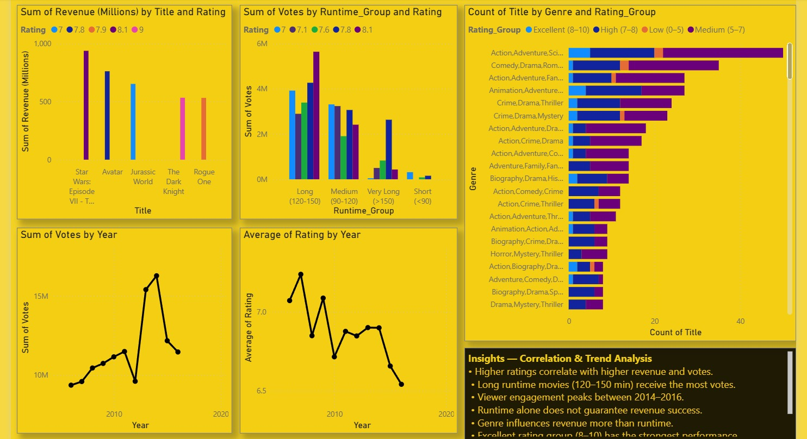
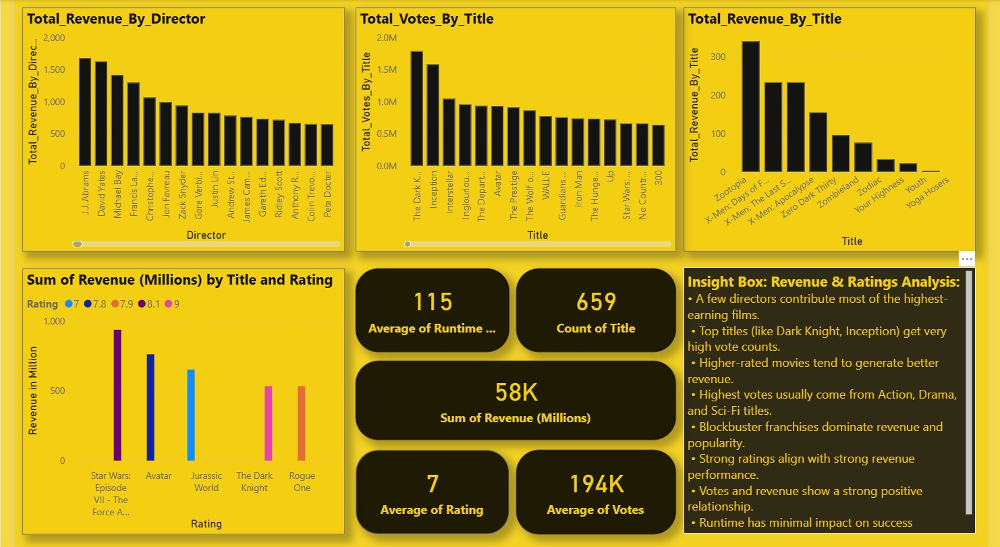
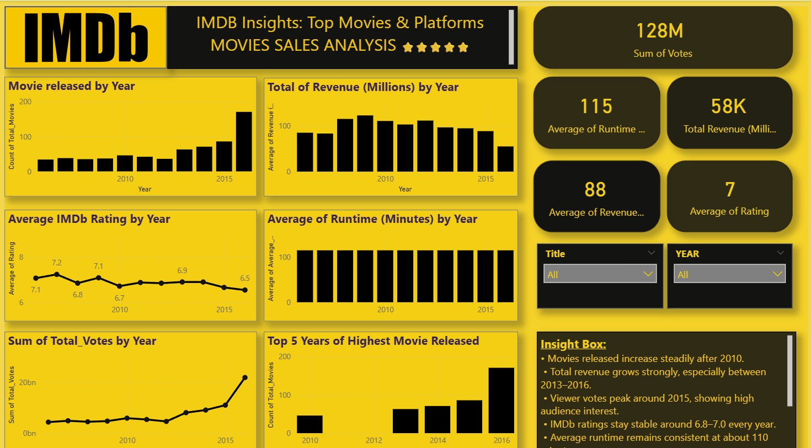

# 🎬 Movie Sales Analysis using Power BI

## 📌 Project Overview
In this project, I analyzed IMDb movie sales data using Power BI to understand box office performance, audience behavior, and rating trends. The goal was to transform raw movie data into meaningful insights through interactive dashboards as part of my academic project.


## 🎯 Problem Statement
The movie industry generates large volumes of data related to revenue, ratings, votes, genres, and release years. However, this data does not clearly explain what drives movie success.  
This project aims to analyze movie sales data to identify patterns in box office revenue, genre performance, audience engagement, and critical ratings to support data-driven decision-making.

---

## 📂 Dataset Description
The dataset used in this project contains the following attributes:
- Rank
- Title
- Genre
- Description
- Director
- Actors
- Year
- Runtime (Minutes)
- IMDb Rating
- Votes
- Revenue (Millions)
- Metascore

---

## 🗂 Project Structure
The repository is organized as follows:

```text
Movie_Sales_Analysis/
│
├── data/
│   └── IMDB-Movie-Data.csv
│
├── reports/
│   └── Movie_sales_Analysis.pbix
│
├── visualizations/
│   ├── Movie_Overview_&_Time_Trends.jpeg
│   ├── Genre_&_Rating_Analysis.jpeg
│   ├── Top_Performers_&_Box_Office_Insights.jpeg
│   └── Correlation_&_Advanced_Metrics.jpeg
│
└── README.md

## 🛠 Project Methodology

### 1. Data Loading & Preparation
- Imported the IMDb dataset into Power BI Desktop
- Checked for missing values and incorrect data types
- Cleaned and formatted columns such as Genre, Year, Runtime, and Revenue
- Prepared data for analysis and visualization

### 2. Data Modeling & DAX
- Created measures using DAX for:
  - Total Revenue
  - Total Votes
  - Average IMDb Rating
  - Average Runtime
  - Average Metascore
  - Total Number of Movies
- Used DAX to calculate KPIs and enable dynamic analysis

### 3. Dashboard Design
- Designed multiple report pages for:
  - Movie overview and time-based trends
  - Genre and rating analysis
  - Top performers and box office insights
  - Correlation and advanced metrics
- Added slicers for Year and Movie Title to make the dashboard interactive

---
## 📈 Dashboard Visualizations

### 🔹 Movie Overview & Time Trends


**Insights:**
- Movie releases increased steadily after 2010
- Revenue and votes peaked between **2013–2016**
- Average IMDb rating remained stable over the years
- Runtime stayed consistent around 110–115 minutes

---

### 🔹 Genre & Rating Analysis


**Insights:**
- **Action and Adventure** genres generate the highest revenue
- **Drama** has the highest number of movies
- Biography and Drama genres receive higher IMDb ratings
- Genre has a stronger impact on revenue than runtime

---

### 🔹 Top Performers & Box Office Insights


**Insights:**
- A small number of directors generate most of the revenue
- Top movies receive both **high votes and high revenue**
- Popular franchises dominate box office collections

---

### 🔹 Correlation & Advanced Analysis


**Insights:**
- Strong positive correlation between **votes and revenue**
- Higher-rated movies tend to earn more
- Runtime alone does not guarantee box office success
- Audience engagement is a key revenue driver

---

## 🔍 Key Insights
- Movies with higher IMDb ratings generally generate higher revenue
- Action and Adventure genres dominate box office collections
- Audience engagement peaks between 2013 and 2016
- Runtime alone does not guarantee box office success
- A small number of directors contribute most of the total revenue
- There is a strong positive correlation between votes and revenue

---

## 📈 Visualizations Used
- Cards
- Bar and Column Charts
- Line Charts for trend analysis
- Stacked Bar Charts
- Donut Charts
- Interactive slicers

---

## 🛠 Tools & Technologies
- Power BI Desktop
- DAX (Data Analysis Expressions)
- IMDb Movie Dataset

---

## 📌 Conclusion
This project demonstrates how Power BI can be used to analyze movie sales data and generate meaningful insights. The analysis highlights that audience engagement, genre popularity, and ratings are key drivers of box office success. This project strengthened my skills in data cleaning, DAX, visualization, and data storytelling.
